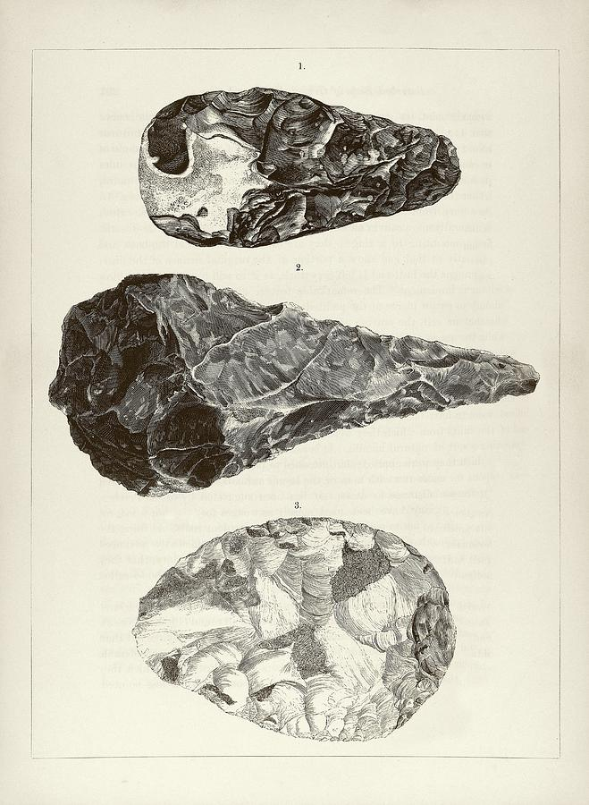
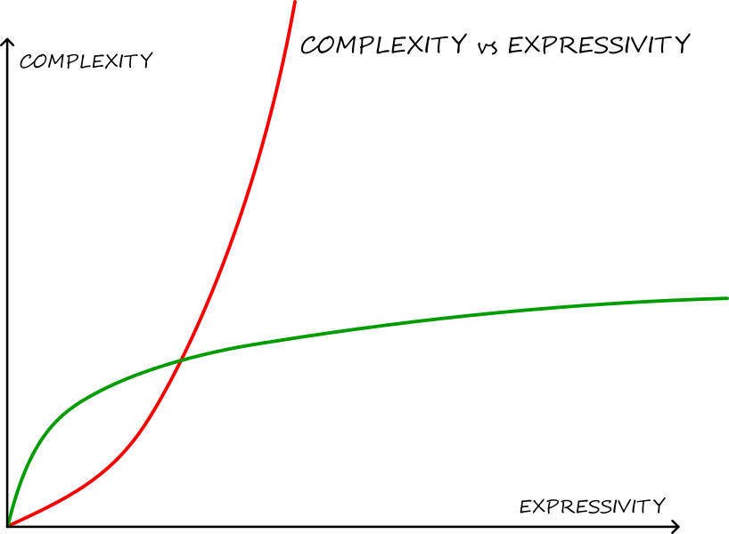
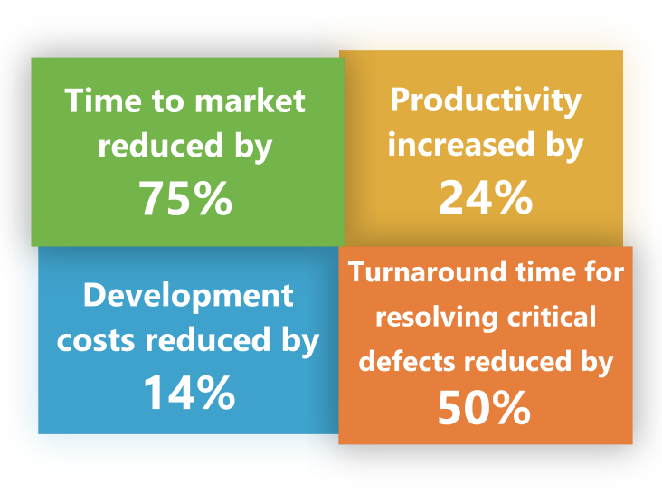
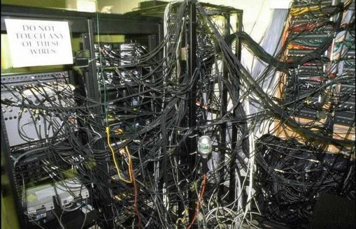

<!-- .slide: data-background="#2aa198" -->
<!-- .slide: data-state="terminal" -->
# Compile-Time Validation

A motivation for functional programming

By [Tamás Pallagi](https://hu.linkedin.com/in/tom-pallagi)

!!!

<!-- .slide: data-background="#2aa198" -->
<!-- .slide: data-state="terminal" -->
# How to Build

Note:
When the compiler can immediately tell when you make a mistake, it feels like you are working against it.
This creates the fundamental experience that all computer science students are very familiar with.
It feels like banging rocks together.

%%%

Note:
Let's say I want to build something permanent, but I don't know anything about building things.
Like a child, the best I can do is some stones stacked on top of each other.
But I want to build something bigger and better, so I need to experiment and learn more.

%%%

Note:
So I bang rocks together, trying to make them fit together.
My understanding is very primitive, and all I have is hard work and my ability to learn.
But if I keep on doing this long enough, I can learn to control where the stones crack.
This is very useful for making tools, but I can't really make bricks this way.

%%%

Note:
Using some materials that I can get from stones, like copper and iron, I can make much stronger tools.
With metal tools, I can carve and chisel rocks into any shape, into smooth bricks.
Finally, with smooth bricks I can build much bigger things.
But still, the most complex structure I can build at the largest scale is a pyramid.

!!!

<i>
Most software today is very much like an Egyptian pyramid  
&nbsp;with millions of bricks piled on top of each other,  
&nbsp;with no structural integrity,  
&nbsp;but just done by brute force and thousands of slaves.  
</i>

*Alan Kay*

!!!

### Eiffel tower is not a pyramid

Note:
Building a structure like Eiffel tower is impossible this way.
Real innovation was needed just to be able to build it.
- tower cranes, that were mounted on the elevators
    - move up as the construction progressed
- portable forges, that heated rivets close to their assembly
    - allowed riveting all the way up the tower

!!!

### The Software Problem

!!!

### Complexity hurts

- <!-- .element: class="fragment" data-fragment-index="1" --> Higher test effort <!-- .element: class="fragment" data-fragment-index="1" -->
- <!-- .element: class="fragment" data-fragment-index="2" --> More human error <!-- .element: class="fragment" data-fragment-index="2" -->
- <!-- .element: class="fragment" data-fragment-index="3" --> Unsustainable <!-- .element: class="fragment" data-fragment-index="3" -->

!!!

### Consequences

- <!-- .element: class="fragment" data-fragment-index="1" --> High development cost <!-- .element: class="fragment" data-fragment-index="1" -->
- <!-- .element: class="fragment" data-fragment-index="2" --> High maintenance cost <!-- .element: class="fragment" data-fragment-index="2" -->
- <!-- .element: class="fragment" data-fragment-index="3" --> Long time to market <!-- .element: class="fragment" data-fragment-index="3" -->

!!!

### Improve, But How?

- <!-- .element: class="fragment" data-fragment-index="1" --> Mathematical Abstractions <!-- .element: class="fragment" data-fragment-index="1" -->
- <!-- .element: class="fragment" data-fragment-index="2" --> Functional Programming <!-- .element: class="fragment" data-fragment-index="2" -->
- <!-- .element: class="fragment" data-fragment-index="3" --> Type-Driven Development <!-- .element: class="fragment" data-fragment-index="3" -->
- <!-- .element: class="fragment" data-fragment-index="4" --> Domain Specific Languages <!-- .element: class="fragment" data-fragment-index="4" -->

!!!

### Results

These numbers are made up...or are they?

!!!

### Incremental Improvements?

Note:
Education and fundamental changes.  
Incremental improvements cannot get us there.

%%%

### Why: Mathematical Abstractions
Proper abstractions are mathematical.

- Universal
- Proven laws

%%%

### Why: Functional Programming

Relies on math and computer science.

- Composition
- Pure functions
- Mathematical proofs

Note:
- Composition: leads to increased flexibility, reusability
- Pure functions: free from effects and co-effects; easy to develop with, easy to test
- Pure functions are a lot easier to reason about

%%%

### Why: Functional Programming

<i>
Because in functional languages 
most design patterns are either invisible or simpler.
</i>

A more expressive language leads to less code.  
Less code is easier to write and maintain.

%%%

### Why: Type-Driven Development

- Make invalid programs unrepresentable
- *Structural* vs. *Nominal* typing

%%%

### Why: Domain Specific Languages

Well, because...

*“C is a basically domain-specific language for writing unsafe code”*  
*Yes, yes it is.*

> https://twitter.com/CodaFi_/status/852370310213103616?ref_src=twsrc%5Etfw

%%%

### Why: Domain Specific Languages

Jokes aside:

- Specialized to a particular problem domain
- Less expressive, but much easier to learn
- SQL for databases, instead of Java
- Functional languages create DSLs

!!!

<!-- .slide: data-background="#2aa198" -->
<!-- .slide: data-state="terminal" -->
# Deep Dive

### Functional Programming

!!!

### Example 1: State Machines

Note:

- add *phantom types* -> type-safe transitions

%%%

### Example 1.2: File Paths

Note:

- add *phantom types* -> type-safe construction
- add *mathematical abstractions* -> type-safe combinations

!!!

### Example 2: Write to Console

Note:

- applying Functional Programming:
	- *functional architecture* -> pure core, impure shell
	- *mathematical abstractions* -> usable syntax

!!!

<!-- .slide: data-background="#2aa198" -->
<!-- .slide: data-state="terminal" -->
# Thank you!

[Tamás Pallagi](https://hu.linkedin.com/in/tom-pallagi)
